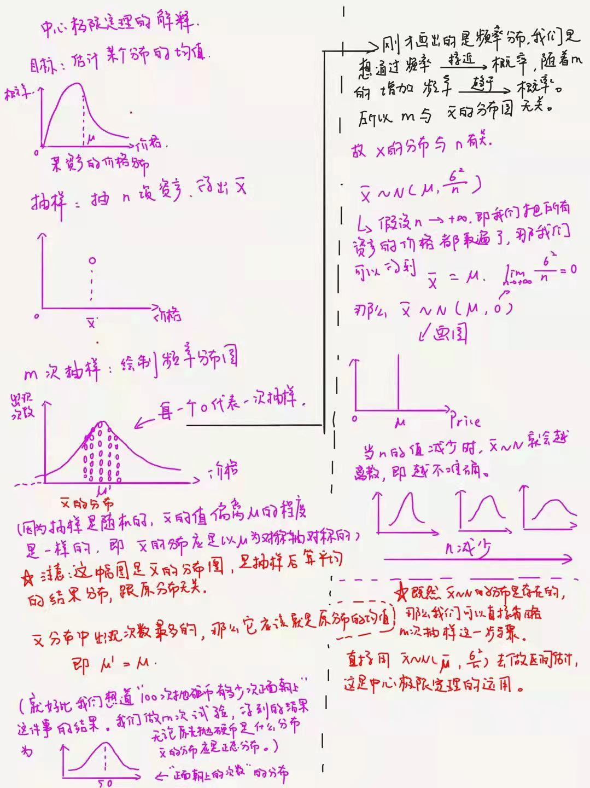

# Mechaine Learning--潘登同学的机器学习笔记
# 目录
+ [有监督机器学习](#index1)
  + 多元线性回归
  + 

# 有监督机器学习

## 多元线性回归(MLR)

+ `总目标`：预测

+ `模型：`
$$
y = \beta_0 + \beta_1x_1 + \cdots + \beta_kx_k
$$

+ `优化目标：`预测的越精确越好, 预测误差(残差)越小越好
> Actual value:真实的y值(样本中自带的)
> 
> Predicted value:预测的y值(通过多元线性回归得出的y,通常记作 $\hat{y}$
> 
> error:预测值与真实值的误差(error = $\hat{y} - y$)
> 
> loss:表示我们最优化的目标,我们希望残差越小越好

$$
Loss = \sum_{n=1}^{m} error^{2} = \sum_{n=1}^{m} (\hat{y} - y)^{2}
$$

+ `求解目标：`
$$
\min_{\beta_0,\beta_0,\ldots,\beta_k} Loss = \min_{\beta_0,\beta_0,\ldots,\beta_k} \sum_{n=1}^{m} error^{2} = \min_{\beta_0,\beta_0,\ldots,\beta_k} \sum_{n=1}^{m} (\hat{y} - y)^{2}
$$
上述目标称为MSE(Mean Square Error),我们习惯用$\theta$来代替这一串${\beta_0,\beta_0,\ldots,\beta_k}$

### 由极大似然估计(MLE, Maximum likelihood estimation)推导MSE

+ 理解为什么$\theta$不是唯一的
> 因为数据都是从总体中抽样出来的,只要我们的样本不同,${\theta}$就不会相同,我们将特定样本计算出的${\theta}$称为$\hat{\theta}$,所以我们只能得到$\hat{\theta}$的无偏估计,而不能得到${\theta}$的无偏估计(除非我们的样本就是总体);

问题1: 那么我们凭什么能用样本计算出的$\hat{\theta}$来代替${\theta}$

+ 解决上面的问题, 采用中心极限定理

问题2: 中心极限定理又跟$\hat{\theta}$可以当作${\theta}$有什么关系呢？

+ 构造似然函数,最大化总似然

假若说我们已经对样本进行了模型求解,那么我们得到了某个具体的$\hat{\theta_1}$

那么这个$\hat{\theta_1}$到底有多像${\theta}$呢？
> 给定一个概率分布 D，已知其概率密度函数（连续分布）或概率质量函数（离散分布）为 f_D，以及一个分布参数θ，我们可以从这个分布中抽出一个具有 m 个值的采样 $x_1,x_2,\ldots,x_m$,利用f_D计算似然函数：
> $$ L(\theta|x_1,x_2,\ldots,x_m) = f_{\theta}(x_1,x_2,\ldots,x_m)$$
> 
> 若 D 是离散分布，$f_{\theta}$ 即是在参数为θ时观测到这一采样的概率。若其是连续分布，$f_{\theta}$ 则为 $x_1,x_2,\ldots,x_m$ 联合分布的概率密度函数在观测值处的取值。
> 
> 一旦我们获得了$x_1,x_2,\ldots,x_m$,那么我们就能获得一个关于${\theta}$的估计(也就是$\hat{\theta}$)
> 
> 最大似然估计会寻找关于${\theta}$的最可能的值（即，在所有可能 的${\theta}$取值中，寻找一个值使这个采样的“可能性”最大化）。从数学上来说，我们可以在${\theta}$的所有可能取值中寻找一个值使得`似然函数取到最大值`。这个使可能性最大的$\hat{\theta}$值即称为${\theta}$的最大似然估计。由定义，最大似然估计是关于样本的函数。

问题3：那这个概率密度函数是什么呢？
> 由中心极限定理,这个概率密度函数是正态分布,其概率密度函数为
> $$ f(x|\mu,\sigma^2) = \frac{1}{\sqrt{2\pi\sigma^2}}e^{-\frac{(x-\mu)^2}{2\sigma^2}} $$

但是我们需要的是估计${\theta}$, 我们转变一下思路,只要在给定样本$X_{m\times n}$,计算出$\hat{\theta}$之后, 其实$\hat{y}$就知道了, 那么误差项 $\varepsilon$就能知道了, 且$\varepsilon$的大小其实跟$\hat{\theta}$准不准确是有极大关联的(很好理解，$\hat{\theta}$越准确,$\varepsilon$越小, 这个可以证明);

所以我们可以用$\varepsilon$来做最大似然估计
$$ 
f(\varepsilon_i|\mu,\sigma^2) = \frac{1}{\sqrt{2\pi\sigma^2}}e^{-\frac{(\varepsilon_i-\mu)^2}{2\sigma^2}}
$$

而$\varepsilon$的均值为0, 这个其实是我们的一项假设, 但是它其实也不是假设, 当我们完成我们的优化目标时, 这个均值假设其实就变成一个可以推导出的结论;所以上式改写成：
$$ 
f(\varepsilon_i|\mu,\sigma^2) = \frac{1}{\sqrt{2\pi\sigma^2}}e^{-\frac{(\varepsilon_i-0)^2}{2\sigma^2}}
$$

那么我们的似然函数就可以表示为：
$$
L_\theta(\varepsilon_1, \varepsilon_2, \ldots, \varepsilon_m)=f(\varepsilon_1, \varepsilon_2, \ldots, \varepsilon_m|\mu,\sigma^2)
$$

又因为残差$\varepsilon$服从正态分布, 自然暗含了相互独立的假设,可以把上面的式子写成连乘的形式：
$$
f(\varepsilon_1, \varepsilon_2, \ldots, \varepsilon_m|\mu,\sigma^2)=f(\varepsilon_1|\mu,\sigma^2)*f(\varepsilon_2|\mu,\sigma^2)*\cdots*f(\varepsilon_m|\mu,\sigma^2)
$$
进而有：
$$
L_\theta(\varepsilon_1, \varepsilon_2, \ldots, \varepsilon_m) = \prod_{i=1}^{m} f(\varepsilon_i|\mu,\sigma^2) = \prod_{i=1}^{m} \frac{1}{\sqrt{2\pi\sigma^2}}e^{-\frac{(\varepsilon_i-0)^2}{2\sigma^2}}
$$

把$x_i$和$y_i$带入上式:
$$
\varepsilon_i = \hat{y} - y = \theta x_i - y_i\\
L_\theta(\varepsilon_1, \varepsilon_2, \ldots, \varepsilon_m) = \prod_{i=1}^{m} \frac{1}{\sqrt{2\pi\sigma^2}}e^{-\frac{(\theta ^{T}x_i - y_i)^2}{2\sigma^2}}
$$
`最大化总似然:`
$$
\argmax_{\theta} L_\theta(\varepsilon_1, \varepsilon_2, \ldots, \varepsilon_m) = \argmax_{\theta} \prod_{i=1}^{m} \frac{1}{\sqrt{2\pi\sigma^2}}e^{-\frac{(\theta ^{T}x_i - y_i)^2}{2\sigma^2}}
$$
+ 对数似然函数

对上面总似然函数取对数,得到的函数记为为${\Bbb{L}}$：
$$
{\Bbb{L}} = \argmax_{\theta} log_e(\prod_{i=1}^{m} \frac{1}{\sqrt{2\pi\sigma^2}}e^{-\frac{(\theta ^{T}x_i - y_i)^2}{2\sigma^2}})=\argmax_{\theta} \sum_{i=1}^{m}\log_e(\frac{1}{\sqrt{2\pi\sigma^2}}e^{-\frac{(\theta ^{T}x_i - y_i)^2}{2\sigma^2}})
$$

+ 继续往下推(这里省略了,因为只是体力活而已)
$$
{\Bbb{L}} = \argmax_{\theta} m\bullet \ln \frac{1}{\sqrt{2\pi\sigma^2}} - \frac{1}{\sigma^2}\bullet\frac{1}{2}\bullet \sum_{i=1}^{m}(\theta ^{T}x_i - y_i)^2
$$
那么前面一项是常数, 最大化${\Bbb{L}}$就是最小化$\sum_{i=1}^{m}(\theta ^{T}x_i - y_i)^2$

那么,就推导出了我们的优化目标： `残差平方和最小`

在Machine Learning中都是通过最小化Loss来达到训练的目的, 所以这个残差平方和就是Loss,并把它称之为MSE；

### 简单导数知识推导解析解($\theta = (X^TX)^{-1}X^TY$)

